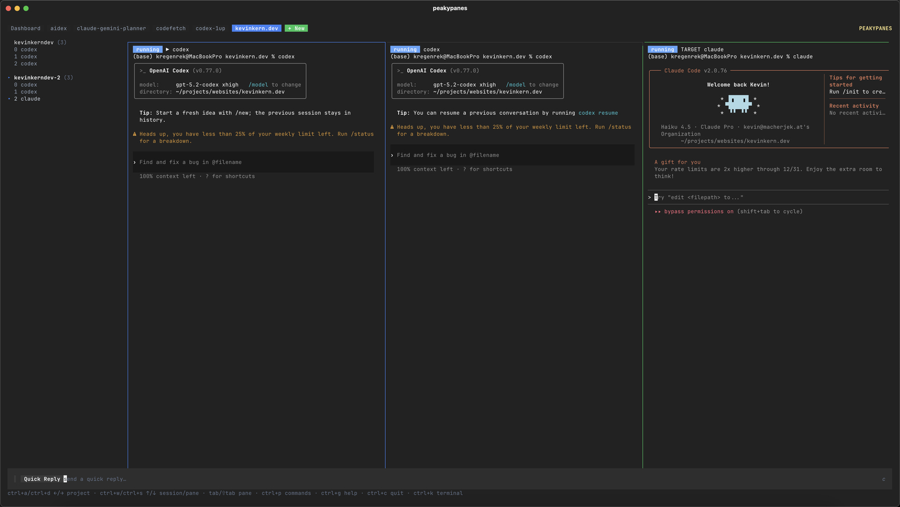

# Peaky Panes

```
████    █████    ███    █   █   █   █    ████      ███    █   █    █████    ████
█████   ████    █████   ████     ███     █████    █████   ███ █    ████    ████ 
█       █████   █   █   █  ██     █      █        █   █   █  ██    █████   █████
```

**Multi-project orchestration in a single TUI for AI agents and dev environments.**

[](https://www.npmjs.com/package/peakypanes)
[](https://github.com/regenrek/homebrew-tap)
[![DeepWiki](https://img.shields.io/badge/DeepWiki-regenrek%2Fpeakypanes-blue.svg?logo=data:image/png;base64,iVBORw0KGgoAAAANSUhEUgAAACwAAAAyCAYAAAAnWDnqAAAAAXNSR0IArs4c6QAAA05JREFUaEPtmUtyEzEQhtWTQyQLHNak2AB7ZnyXZMEjXMGeK/AIi+QuHrMnbChYY7MIh8g01fJoopFb0uhhEqqcbWTp06/uv1saEDv4O3n3dV60RfP947Mm9/SQc0ICFQgzfc4CYZoTPAswgSJCCUJUnAAoRHOAUOcATwbmVLWdGoH//PB8mnKqScAhsD0kYP3j/Yt5LPQe2KvcXmGvRHcDnpxfL2zOYJ1mFwrryWTz0advv1Ut4CJgf5uhDuDj5eUcAUoahrdY/56ebRWeraTjMt/00Sh3UDtjgHtQNHwcRGOC98BJEAEymycmYcWwOprTgcB6VZ5JK5TAJ+fXGLBm3FDAmn6oPPjR4rKCAoJCal2eAiQp2x0vxTPB3ALO2CRkwmDy5WohzBDwSEFKRwPbknEggCPB/imwrycgxX2NzoMCHhPkDwqYMr9tRcP5qNrMZHkVnOjRMWwLCcr8ohBVb1OMjxLwGCvjTikrsBOiA6fNyCrm8V1rP93iVPpwaE+gO0SsWmPiXB+jikdf6SizrT5qKasx5j8ABbHpFTx+vFXp9EnYQmLx02h1QTTrl6eDqxLnGjporxl3NL3agEvXdT0WmEost648sQOYAeJS9Q7bfUVoMGnjo4AZdUMQku50McDcMWcBPvr0SzbTAFDfvJqwLzgxwATnCgnp4wDl6Aa+Ax283gghmj+vj7feE2KBBRMW3FzOpLOADl0Isb5587h/U4gGvkt5v60Z1VLG8BhYjbzRwyQZemwAd6cCR5/XFWLYZRIMpX39AR0tjaGGiGzLVyhse5C9RKC6ai42ppWPKiBagOvaYk8lO7DajerabOZP46Lby5wKjw1HCRx7p9sVMOWGzb/vA1hwiWc6jm3MvQDTogQkiqIhJV0nBQBTU+3okKCFDy9WwferkHjtxib7t3xIUQtHxnIwtx4mpg26/HfwVNVDb4oI9RHmx5WGelRVlrtiw43zboCLaxv46AZeB3IlTkwouebTr1y2NjSpHz68WNFjHvupy3q8TFn3Hos2IAk4Ju5dCo8B3wP7VPr/FGaKiG+T+v+TQqIrOqMTL1VdWV1DdmcbO8KXBz6esmYWYKPwDL5b5FA1a0hwapHiom0r/cKaoqr+27/XcrS5UwSMbQAAAABJRU5ErkJggg==)](https://deepwiki.com/regenrek/peakypanes)
[](https://pkg.go.dev/github.com/regenrek/peakypanes)





Run all your projects and AI agents in one dashboard instead of juggling terminal windows or tabs. Define layouts in YAML, share them with your team via git, and get consistent environments everywhere. Sessions are owned by a **native daemon** so they keep running after the UI exits.

## Why?

Running multiple agents on different projects at the same time takes real organization and 
a different approach to how we do agentic coding.

I built Peky to solve my own problems with juggling too many windows and wasting time on setup
and rebuilding the same environment every time. It lets you build your own reusable 
window layouts and better-organized projects.

## Features

- 🧠 **AI agent orchestration** - Run Codex/Claude/agents side by side with quick replies, slash commands, and broadcast
- 🗂️ **Multi-project dashboard** - See every project/session in one TUI without switching windows
- 📦 **Built-in layouts** - Works out of the box with sensible defaults
- 🧩 **Exact grids** - Use `grid: 2x3` for consistent rows/columns
- 📁 **Project-local config** - Commit `.peky.yml` to git for team sharing
- 🏠 **Global config** - Define layouts once, use everywhere
- 🔄 **Variable expansion** - Use `${EDITOR}`, `${PROJECT_PATH}`, etc.
- 🎯 **Zero config** - Just run `peky` in any directory
- 🧠 **Native live previews** - Full TUI support (vim/htop) with live panes
- 🧭 **Persistent native daemon** - Sessions keep running after the UI exits
- 📜 **Scrollback + copy mode** - Navigate output and yank from native panes
- ⌘ **Command palette** - Quick actions, including renaming sessions/panes
- 🖱️ **Mouse support** - Click to select panes, double-click to focus a pane

## Quick Start

### Install

**Using npm (recommended)**

```bash
npm i -g peakypanes
peky
```

**Run once with npx**

```bash
npx -y -p peakypanes peky
```

**Using Homebrew**

```bash
brew tap regenrek/tap
brew install regenrek/tap/peky
brew services start peky
peky
```

Using Go

```bash
go install github.com/regenrek/peakypanes/cmd/peky@latest
```

### Usage

**Start:**
```bash
peky start
```

## Custom Configuraton

**Create project-local config (recommended for teams):**
```bash
cd your-project
peky init --local
# Edit .peky.yml
git add .peky.yml  # Share with team
```

The CLI is `peky`.

## Documentation

- [Configuration & layouts](docs/configuration.md)
- [Layout builder guide](docs/layout-builder.md)
- [Dashboard & keybindings](docs/dashboard.md)
- [CLI reference](docs/cli.md)
- [Performance tuning](docs/performance.md)
- [Testing](docs/testing.md)
- [Daemon & troubleshooting](docs/troubleshooting.md)
- [Release process](RELEASE-DOCS.md)

## Configuration (quick look)

Project-local config lives in `.peky.yml`, and global config lives in `~/.config/peky/config.yml`.
See the full schema, built-in layouts, and variable expansion in [docs/configuration.md](docs/configuration.md).

```yaml
session: my-project

layout:
  panes:
    - title: editor
      cmd: "${EDITOR:-}"
    - title: server
      cmd: "npm run dev"
      split: horizontal
```

## Dashboard

The dashboard shows projects, sessions, live previews, and a quick-reply bar for slash commands and broadcasts.
When the quick reply input is empty, common terminal keys (Enter/Esc/arrows/tab) are forwarded to the selected pane for interactive prompts.
See [docs/dashboard.md](docs/dashboard.md) for keybindings, slash command behavior, and dashboard configuration.

## CLI

See [docs/cli.md](docs/cli.md) for the full command list and examples.

## Testing

See [docs/testing.md](docs/testing.md) for the full test matrix and CI notes.
For heavy concurrency/regression coverage, run `scripts/cli-stress.sh` locally.
For profiling + benchmarks, see [docs/performance.md](docs/performance.md).

## Release

See `RELEASE-DOCS.md` for the full release checklist (tests, tag, GoReleaser, npm publish).

## Windows
> npm packages are currently published for macOS and Linux.  
> Windows users should install from the GitHub release or build with Go.


## For Teams

1. Run `peky init --local` in your project
2. Customize `.peky.yml` for your stack
3. Commit to git
4. Teammates install peakypanes and run `peky` - done!

## License

MIT

## Credits

[@pi-mono](https://github.com/badlogic/pi-mono) - Peky Agent is inspired by PI / [Mario Zechner's](https://x.com/badlogicgames) work. 
(Direct pi integration would've been ideal, but 60 MB of Node for agent + sidecar isn't worth it)
[@charm](https://github.com/charmbracelet) - peaky is using bubbletea and lipgloss

## Links

- X/Twitter: [@kregenrek](https://x.com/kregenrek)
- Bluesky: [@kevinkern.dev](https://bsky.app/profile/kevinkern.dev)

## Courses
- Learn Cursor AI: [Ultimate Cursor Course](https://www.instructa.ai/en/cursor-ai)
- Learn to build software with AI: [AI Builder Hub](https://www.instructa.ai)

## See my other projects:

* [codefetch](https://github.com/regenrek/codefetch) - Turn code into Markdown for LLMs with one simple terminal command
* [instructa](https://github.com/orgs/instructa/repositories) - Instructa Projects
